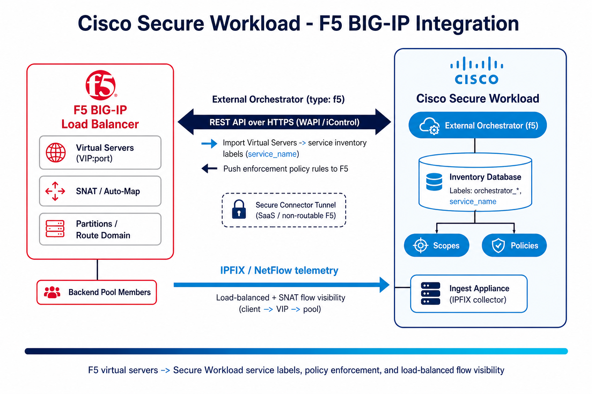

# Cisco Secure Workload → F5 BIG-IP Integration Guide

A step-by-step, **beginner-friendly** integration guide for **F5 BIG-IP** + **Cisco Secure Workload (CSW)** — covering **service-inventory labels**, **policy enforcement to the BIG-IP**, and **IPFIX flow visibility** of load-balanced traffic.

> **⚠ Disclaimer:** This is a **community reference guide** prepared by Cisco Solutions Engineering — not an official Cisco product document. Always refer to the [official Cisco Secure Workload documentation](https://www.cisco.com/c/en/us/support/security/tetration/series.html) and the [Compatibility Matrix](https://www.cisco.com/c/m/en_us/products/security/secure-workload-compatibility-matrix.html) for authoritative, up-to-date guidance.

---

## What This Covers

| Area | Detail |
|---|---|
| **Path 1 — External Orchestrator** (`type: f5`) | Import F5 **virtual servers** as *service inventory* labels; optionally **enforce policy** to the BIG-IP |
| **Path 2 — Flow telemetry** | BIG-IP exports **IPFIX/NetFlow** to a CSW ingest appliance for load-balanced flow visibility |
| **Transport** | HTTPS iControl REST API (orchestrator) · IPFIX/UDP (telemetry) |
| **Enforcement** | CSW translates policies → F5 security rules (requires **write** creds) |
| **Connectivity** | Direct (on-prem) or via **Secure Connector** tunnel (SaaS / non-routable) |
| **Result** | `orchestrator_*` + `service_name` labels, F5 rule deployment, LB flow visibility |
| **Verified against** | CSW 4.x on-prem and SaaS; F5 BIG-IP v12.1.1+ |

---

## Quick Start

### Prerequisites
- F5 BIG-IP with reachable **iControl REST API** (HTTPS/443)
- F5 service account — **read-only** for labels, **read+write** for enforcement
- CSW 4.x with Site Admin / Root Scope Owner rights
- (IPFIX) a CSW **Ingest** appliance with a **NetFlow/IPFIX** connector
- (SaaS only) a healthy **Secure Connector** tunnel
- Firewall: HTTPS (TCP/443) CSW → F5; IPFIX (UDP) F5 self-IP → CSW ingest collector

### Steps (summary)

**Path 1 — Labels + enforcement (External Orchestrator):**
1. `Manage → External Orchestrators → Create New Configuration`
2. **Type = F5 BIG-IP**; enter Name, Username, Password
3. **Hosts List** → F5 mgmt IP, port `443` (use the **standby** node for HA)
4. Set **Route Domain** (default `0`); leave **Enable Enforcement** off at first
5. **Create** (first snapshot ~60s). Check **Secure Connector Tunnel** for SaaS
6. Later, turn on **Enable Enforcement** + enforce a workspace policy (needs write creds)

**Path 2 — Flow visibility (IPFIX):**
1. Deploy/confirm a CSW **Ingest** appliance + **NetFlow/IPFIX** connector (note IP:UDP port)
2. On F5: create Pool → IPFIX **Log Destination** → **Log Publisher** → attach to virtual servers
3. Verify in `Investigate → Flows`

**Verify labels:**
1. `Investigate → Inventory Search`
2. Run `orchestrator_system/orch_type = f5`
3. Use `orchestrator_*` / `service_name` labels to build **scopes** and **policies**

See the [full step-by-step guide](CSW-F5-Integration-Guide.md) or [open the HTML version](CSW-F5-Integration-Guide.html) for detailed instructions.

---

## Video Walkthroughs

Curated from the [CSW-User-Education](https://github.com/chandrapati/CSW-User-Education) video library:

| Video | What it shows |
|---|---|
| [F5 BIG-IP IPFIX Configuration](https://www.youtube.com/watch?v=aJZEcZtUXDg) | Export IPFIX flow telemetry from BIG-IP into Secure Workload |
| [F5 BIG-IP & Cisco Tetration: APM Visibility](https://www.youtube.com/watch?v=dqbWhvFNsso&t=90s) | F5 APM (Access Policy Manager) application/user visibility |
| [Cisco Tetration & F5 BIG-IP AFM](https://www.youtube.com/watch?v=HcF3yQHmeXc) | F5 AFM (Advanced Firewall Manager) flow context |

> *Tetration* is the former name for Cisco Secure Workload — the concepts apply directly.

---

## Architecture Diagram

*Two data paths: the External Orchestrator (HTTPS REST) imports virtual servers as service labels and pushes enforcement rules; IPFIX/NetFlow telemetry gives CSW load-balanced flow visibility.*

---

## Files in This Repo

| File | Description |
|---|---|
| [`README.md`](README.md) | This file — quick start and overview |
| [`CSW-F5-Integration-Guide.md`](CSW-F5-Integration-Guide.md) | Full step-by-step guide (Markdown source) |
| [`CSW-F5-Integration-Guide.html`](CSW-F5-Integration-Guide.html) | Styled HTML — open in browser (embedded YouTube player) |
| [`csw-f5-architecture.png`](csw-f5-architecture.png) | Architecture diagram |
| [`build.sh`](build.sh) | Regenerate HTML/PDF from Markdown (requires pandoc + Chrome) |
| [`docs/CUSTOMER-HANDOFF.md`](docs/CUSTOMER-HANDOFF.md) | Checklist to hand to the customer's F5 / network team |

---

## Imported Labels — Quick Reference

| Key | Value |
|---|---|
| `orchestrator_system/orch_type` | `f5` |
| `orchestrator_system/workload_type` | `service` |
| `orchestrator_system/service_name` | *(virtual server name)* |
| `orchestrator_system/namespace` | *(partition)* |
| `orchestrator_annotation/snat_address` | *(SNAT address)* |

> **Important:** Only **single-address** VIPs are imported (not subnet VIPs). Enabling policy enforcement makes **CSW the owner** of the virtual server's security rules; disabling it **removes** those rules from the BIG-IP.

---

## Related Cisco Secure Workload Resources

| Repository | Description | Best for |
|------------|-------------|---------|
| [User Education](https://github.com/chandrapati/CSW-User-Education) | Onboarding guides and concept explainers | New CSW users |
| [Agent Installation](https://github.com/chandrapati/CSW-Agent-Installation-Guide) | Deploy CSW agents on Linux / Windows / cloud | Day-1 sensor deployment |
| [Policy Lifecycle](https://github.com/chandrapati/CSW-Policy-Lifecycle) | Policy discovery → enforcement workflow | Policy management |
| [ISE / pxGrid](https://github.com/chandrapati/csw-ise-integration) | ISE/pxGrid: user-identity–aware microsegmentation | Identity & Zero Trust |
| [AnyConnect NVM](https://github.com/chandrapati/csw-anyconnect-nvm) | Endpoint process flows + user identity via NVM | Endpoint telemetry |
| [ServiceNow CMDB](https://github.com/chandrapati/csw-servicenow-integration) | ServiceNow CMDB label enrichment for workload scopes | CMDB-driven policy |
| [Infoblox](https://github.com/chandrapati/csw-infoblox-integration) | Infoblox IPAM/DNS extensible-attribute label enrichment | IPAM/DNS-driven policy |
| [F5 BIG-IP](https://github.com/chandrapati/csw-f5-integration) | F5 virtual-server labels, policy enforcement, IPFIX flow visibility | Load balancer segmentation |
| [AWS Connector](https://github.com/chandrapati/csw-aws-connector) | EC2 tag ingestion + VPC flow logs + Security Group enforcement | AWS workloads |
| [Azure Connector](https://github.com/chandrapati/csw-azure-connector) | Azure VM tag ingestion + VNet flow logs + NSG enforcement | Azure workloads |
| [GCP Connector](https://github.com/chandrapati/csw-gcp-connector) | GCE label ingestion + VPC flow logs + firewall enforcement | GCP workloads |
| [NetFlow](https://github.com/chandrapati/csw-netflow-integration) | NetFlow v9/IPFIX agentless flow ingestion from switches | Network fabric visibility |
| [ERSPAN](https://github.com/chandrapati/csw-erspan-integration) | Agentless packet mirroring for legacy / OT / IoT devices | Deep agentless visibility |
| [Secure Firewall](https://github.com/chandrapati/CSW-Secure-Firewall-Integration-Guide) | NSEL flow ingestion from Cisco Secure Firewall (FTD/ASA) | Firewall flow visibility |
| [Splunk Integration](https://github.com/chandrapati/csw-splunk-integration) | CSW syslog alerts → Splunk SIEM | SecOps / SIEM teams |
| [Compliance Mapping](https://github.com/chandrapati/CSW-Compliance-Mapping) | Map CSW controls to NIST, PCI-DSS, HIPAA, CIS | Compliance & audit |
| [Tenant Insights](https://github.com/chandrapati/CSW-Tenant-Insights) | Tenant-level reporting and analytics | Visibility metrics |
| [Operations Toolkit](https://github.com/chandrapati/CSW-Operations-Toolkit) | Day-2 ops scripts: health checks, reporting, policy analysis | Ongoing operations |

> **Suggested customer journey:**
> User Education → Agent Installation → Policy Lifecycle → ISE/pxGrid → ServiceNow CMDB → Infoblox → **F5 BIG-IP** → Splunk Integration → Compliance Mapping → Operations Toolkit
